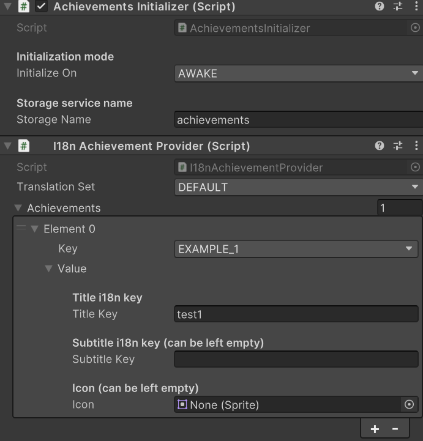

# Get started

Learn how to start using achievements in your game.

## Initialize a Storage service

Achievements will be stored in a storage service, so you will need to initialize the Storage utility before initializing the achievements utility.
If you haven't done so, follow the [Storage utility initialization steps](/docs/utilities/storage/getting-started).

Once you have the storage service initialized, you will need to create a new **Storage instance** in the `StorageInitializer` script. You can name the new instance anything you want, but we recommend you to use _achievements_, as it is descriptive and matches the achievement's default name value.

## Initialize the Achievements utility

Attach the `AchievementsInitializer` script to a GameObject on a scene that is loaded before you start using the achievements API (it is recommended to do so in the first scene of all).
Using the Unity's inspector, modify the values from the initializer:

- Initialization mode: when you want to start the initialization of the utility (keep in mind that this script depends on the Storage utility, so initialization will be idled if Storage is not fully initialized).
- Storage service name: the name you used as the identifier of the Storage service (the one you created before).

## Define available achievements

As you might expect, you need to define all available achievements beforehand.

### Define achievements

Achievement codes are defined in an **enum** in the file `Achievements`. You need to modify this file whenever you want to define new achievements.

### Provide achievements

You need to define all available achievements before being able to use them. This can be easily done by using the _Achievements provider_ script. The package includes two official Achievements providers, but you can build your own by creating a script that implements the `IAchievementProvider`.

The official ones are:

- `SimpleAchievementProvider`: you can use this if you want simple achievements (without i18n).
- `I18nAchievementProvider`: you can use this if you want achievements that are connected to i18n translations. I18n utility needs to be initializated.

Once you have choosen an Achievements Provider, you have to attach the choosen provider to the same GameObject that has the `AchievementsInitializer` script. It will automatically provide dialogs to the initializer script.

<table>
    <tbody>
        <tr>
            <td>
            
            </td>
            <td>
                This example shows how you can fully initialize one achievement named *EXAMPLE_1*. All achievements are stored in the Storage *achievements*.
                In the example we are using the `I18nAchievementProvider`, this means that instead of raw values we are providing i18n keys. In the photo we are using the translation set *DEFAULT* and a title that resolves the i18n key *test1*.
            </td>
        </tr>
    </tbody>
</table>

:::warning About initialization

You are not supposed to initialize achievements more than once for a single game lifecycle. Whenever achievements are initialized you override past initializations. So, initialize all achievements at once at the beginning of the game.

Also, do not attach more than one achievements provider to the `AchievementsInitializer`'s GameObject. Ignoring this statement could lead your game to unexpected behaviours.

:::
