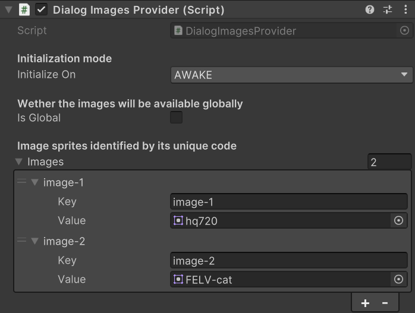
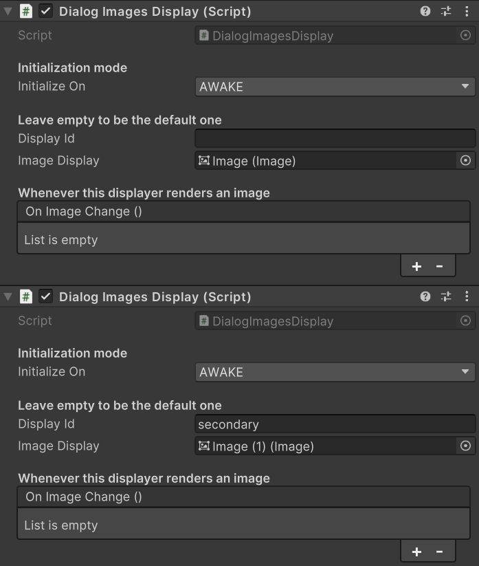

# Dialog images

Dialog images are used to define wich images should be displayed along with the dialog text. They are identified by image code and can target where to be displayed.

## Setup the images provider

As said, you will be identifying images by _image code_ in your dialogs provider. To do so first you need to create a GameObject and attach a `DialogImagesProvider` script. This script, when initialized, will provide images to all dialogs in the scene (if global is checked, it will provide those images also in future scenes). You can fill up the array of **Images** with the images you want and their _image code_ (unique).

:::info note

You can have multiple `DialogImagesProvider` per scene. It is recommended if you have lots of images and you want to keep things organized.

Also remember to check the **global** property if you want to keep some images loaded in memory across all the game's lifecycle (so you don't have to initialize them in every scene).

:::

### Example

Let's see how would this look in a real example. We fill the **Images** array in the `DialogImagesProvider` script providing two images each with their unique code. Then in our dialogs file we can fill up the **images** array indicating the _image code_ in the _image_ field. In this example we are not using the _target_ field, we will learn about it later.

<table>
    <tbody>
        <tr>
            <td>
                
            </td>
            <td>
            ```json
            {
                ...,
                "dialog-8": {
                    "text": "Dialog displayed along with one image",
                    "speaker": "",
                    "images": [
                        {
                            "image": "image-1",
                            "target": ""
                        }
                    ]
                },
                ...
            }
            ```
            </td>
        </tr>
    </tbody>
</table>

## Display images

Now that we are providing images and we are using them in our dialogs file, its time to display them. We can achieve this by using the `DialogImagesDisplay` script.

We need to attach this script to a GameObject. Then we will need to fill up two essential fields.

- **Display Id**: this field represents the id of the displayer (if left empty it will be the default one).
- **Image Display**: this field stores the `UnityEngine.UI.Image` script that will display the image.

You can have more than one displayer per scene. Each will be available during the lifecycle of the attached GameObject.

:::warning

You cannot have more than one displayer with the same **id**. Having repeated ids can lead to unexpected behaviours. You can repeat ids once elder displayers are unloaded, for example, when you change scenes.

:::

### Example

Let's see how we can display images to specific targets.

<table>
    <tbody>
        <tr>
            <td>
                
            </td>
            <td>
            ```json
            {
                ...,
                "dialog-8": {
                    "text": "Dialog displayed along with one image",
                    "speaker": "",
                    "images": [
                        {
                            "image": "image-1",
                            "target": ""
                        }
                    ]
                },
                "dialog-9": {
                    "text": "Dialog that displays two images",
                    "speaker": "",
                    "images": [
                        {
                            "image": "image-1",
                            "target": "secondary"
                        },
                        {
                            "image": "image-2",
                            "target": ""
                        }
                    ]
                },
                ...
            }
            ```
            </td>
        </tr>
    </tbody>
</table>

As you can see, the dialog _dialog-8_ will display the _image-1_ on the default displayer and the _dialog-9_ will display two images, one in the _secondary_ displayer and the other in the default one.
