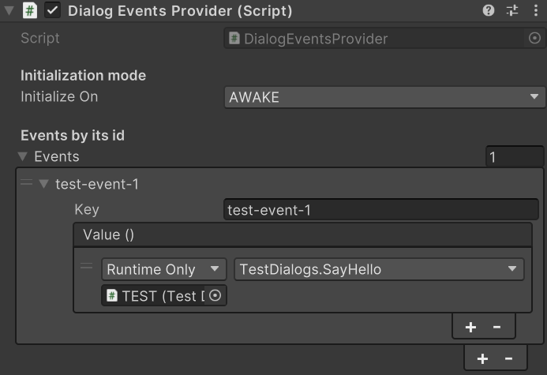

# Dialog events

You can define events that get executed when a dialog is displayed. You will define events with an identifier (one identifier can have multiple events, they stack).

## Providing events

First of all, you need to define the events that will get executed with their respective identifiers. To do so, you need to attach the `DialogEventsProvider` to a GameObject.
Then, you can add an element and fill up the _Key_ with the _eventId_ you want. Also you can provide events that will get executed when this _eventId_ is called.

| Example                                                                |
| ---------------------------------------------------------------------- |
|  |

:::info note

You can have multiple `DialogEventsProvider` scripts loaded in one scene at the same time, even with repeated event ids.

:::

### Providing events programatically

You can also provide events using the _Dialog events provider API_. You have to subscribe to the **onDialogEventCalled** delegate void.
Then you provide a method that accepts a `string` as the only parameter. This string will represent the _eventId_. This method will get called each time an event is invoked.

```cs
void CustomEventHandler(string eventId)
{
    switch (eventId)
    {
        case "test-event-1":
            Debug.Log("Detected test 1!");
            break;
    }
}

void Awake()
{
    // Subscribe to the delegate
    DialogEventsProvider.onDialogEventCalled += CustomEventHandler;
}
void OnDestroy()
{
    // Remove subscription to the delegate
    DialogEventsProvider.onDialogEventCalled -= CustomEventHandler;
}
```

## Defining events on a dialog

Now that we defined our events its time to decide when to invoke them. We can do so by providing the eventIds that will be invoked in each dialog entry we want. For example:

```json
{
    ...,
    "dialog-4": {
        "text": "Now I will cast a testing spell!",
        "speaker": "wizard",
        "images": [],
        "events": [
            "test-event-1"
        ]
    },
    ...
}
```

Once the _dialog-4_ is displayed all events declared as _test-event-1_ will be invoked.
