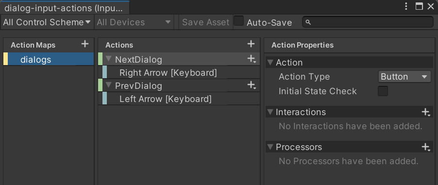

# Dialog managed controls

You might want to enable players to skip dialogs using their keyboards, game controllers or any input device. Also, you might want to have all controller logic centralized. To achieve both goals you can use the `DialogManagedControls` script.

This script has to be present in each scene where dialogs are in use, but only once. It will handle all `DialogController` scripts present in the scene.

## How it works?

This script is automatically recognized by all present `DialogController` scripts. Then, by using its API you can interact with the active `DialogController` (for example, calling _NextDialog()_).

## How to use it with the New Input System

It is recommended to use the New Input System in your new Unity games. If you use it you can easily provide key bindings to your dialogs, just follow a few steps:

- Create an empty GameObject (it will contain scripts related to dialog controls, name it wisely).
- Attach the `DialogManagedControls` script.
- Attach the `PlayerInput` script (official from Unity).
- In your _Assets_ create a `Input Asset` asset (you can reuse an existing one).
- In the _Input Asset_ create a new _Actions map_ for your dialog controls.
- Create actions for each possible interaction (only the ones you need). Action names are important, they need to be one from the [managed actions list](#managed-actions-list).
  
- Finally, attach the _Input Asset_ to the `PlayerInput` script.

### Managed actions list {#managed-actions-list}

Here it is the list of action names you can use as input action names.

- NextDialog: displays the next dialog.
- PrevDialog: displays the previous dialog.
